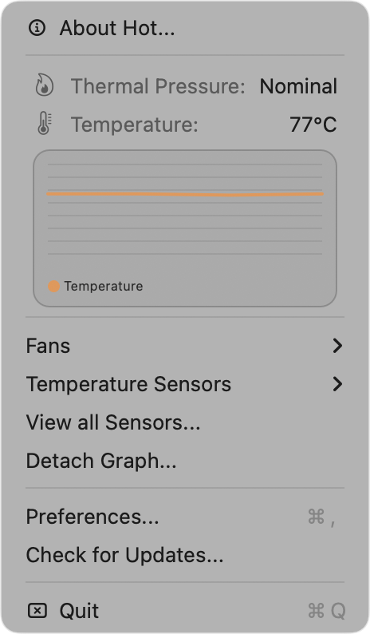
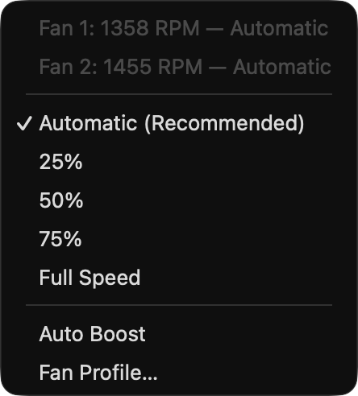
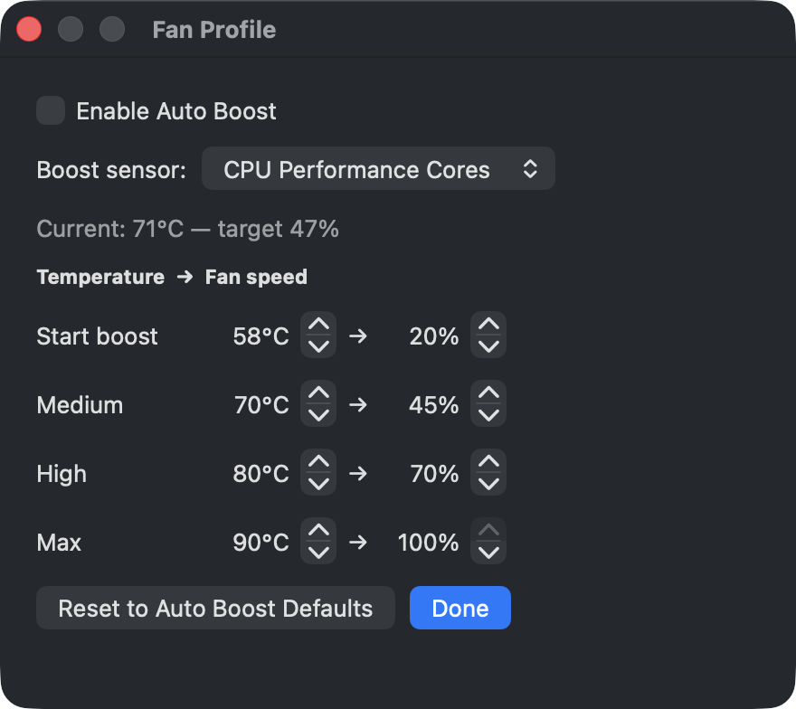
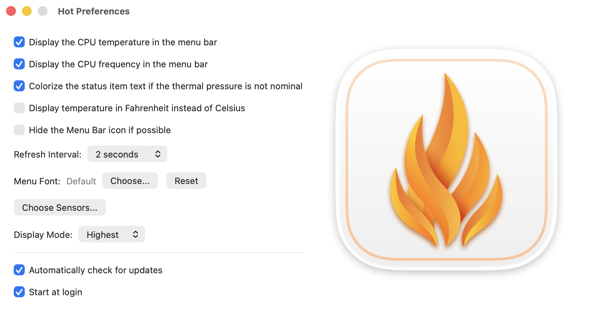

Hot
===

  

### About

Hot is macOS menu bar application that displays the CPU speed limit due to thermal issues.

This fork of [macmade/Hot](https://github.com/macmade/Hot) adds **fan control** support.

#### Differences between the Intel and Apple Silicon versions

On an Intel machine, Hot will display the CPU temperature, CPU speed limit (throttling), scheduler limit and number of available CPUs.  
By default, the menu bar text will be colorized in orange if the CPU speed limit falls below 60%.

On Apple Silicon, these informations are not available.  
Along with the CPU temperature, Hot will display the system's thermal pressure.  
The menu bar text will be colorized in orange if the pressure is not nominal.

A graph view for all sensors may also be displayed on Apple Silicon.

#### Fan Control

The **Fans** menu displays the live RPM of each fan and lets you either
leave the fans under automatic system control (recommended), or force them
to 25%, 50%, 75% or 100% of their supported RPM range.

Writing to the SMC requires root privileges. The **first** time you change a
fan setting, Hot asks for an administrator password once to install a small
root-owned helper (`/Library/PrivilegedHelperTools/hot-fan-helper`) and a
scoped `sudoers` rule that authorizes only that helper. After that, changing
fan speeds — and the automatic restore on quit — no longer prompt for a
password. Manual fan settings are restored to automatic control when the app
quits, and always reset on reboot.

To remove the helper later, delete `/Library/PrivilegedHelperTools/hot-fan-helper`
and `/etc/sudoers.d/hot-fan-control`.

Note that macOS protects itself regardless of fan settings: even at low
fan speeds, the machine will throttle before reaching unsafe temperatures.

##### Auto Boost (temperature-driven fan curve)

Instead of a fixed speed, **Auto Boost** drives the fans automatically from a
temperature curve. Enable it from the **Fans** menu, and open **Fan Profile…**
to customise it:

- **Boost sensor** — the temperature the curve reacts to: *CPU Performance
  Cores*, *CPU Proximity*, or *SoC Die*. Each resolves to the hottest matching
  sensor on your Mac, falling back to the overall CPU temperature.
- **Thresholds** — four temperature → fan-speed points. The defaults match a
  typical curve: start boosting at 58 °C (20 %), 70 °C (45 %), 80 °C (70 %) and
  90 °C (100 %). Below the first threshold the fans stay on automatic system
  control; between points the speed is interpolated; above the last point the
  maximum is held.

Auto Boost runs continuously in the background through the same passwordless
helper, with hysteresis so it doesn't oscillate around a threshold. It hands
the fans back to automatic control when disabled or when the app quits.

#### CPU Frequency (Apple Silicon)

Enable **Display the CPU frequency in the menu bar** in the preferences to
show the live CPU clock speed next to the temperature.

Apple Silicon exposes no public API or `sysctl` for the current CPU clock, so
Hot derives it the same way tools like `powermetrics` do: it samples per-core
P-state residencies through the private `IOReport` framework (resolved at
runtime, so nothing private is linked) and weights them against the
per-cluster frequency tables read from the `pmgr` device-tree node. The value
shown is the average frequency of the cores that were active since the last
refresh, so it rises toward the cores' maximum under load and drops when the
machine is idle.

#### Building this fork

Git submodules have been vendored into the repository, so a plain
`git clone` (without `--recursive`) is sufficient. Open `Hot.xcodeproj`
and build the `Hot` scheme.

License
-------

Project is released under the terms of the MIT License.

Repository Infos
----------------

    Owner:          Jean-David Gadina - XS-Labs
    Web:            www.xs-labs.com
    Blog:           www.noxeos.com
    Twitter:        @macmade
    GitHub:         github.com/macmade
    LinkedIn:       ch.linkedin.com/in/macmade/
    StackOverflow:  stackoverflow.com/users/182676/macmade
